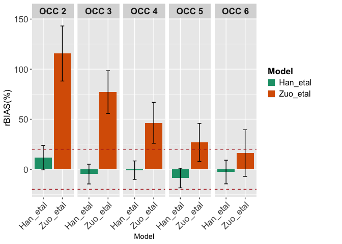

<!-- README.md is generated from README.Rmd. Please edit that file -->

# preDose 

# preDose: An R-package for Robust External Evaluation of popPKPD Models.

preDose is a free and open source package that automatize the process of
*external evaluation process* using an independent dataset from which
the original popPKPD model was developed.

Currently, the user can choose to use the package based on
either[lixoftconnectors](https://monolix.lixoft.com/monolix-api/examples/)
or via [mapbayr](https://github.com/FelicienLL/mapbayr) depending on
whether lixoftconnectors(which comes with the installation of Lixoft
software) is available in their environment.

You can perform an external evaluation for a single model from :

- a population PKPD model (coded in
  [mrgsolve](https://github.com/metrumresearchgroup/mrgsolve), or from
  [Monolix](https://monolix.lixoft.com/demo-projects/modelimplementation/),
- a data set with concentrations (NONMEM format or Monolix format)

The package requires the user to provide a popPKPD model and an external
dataset, regardless of the processing engine they choose. Below are the
functions established for both utilities.

## Installation

You can install the development version of preDose from
[GitHub](https://github.com/) with:

``` r
install.packages("devtools")
devtools::install_github("Martin-Umpierrez/preDose")
```

## Example

This is a basic example which shows you how to solve a common problem
for external evaluation.

``` r
library(preDose)
## basic example code
```

#### 1) Properly code you model

##### 1.1) Code your model in mrgsolve format.

This is an example of a Tacrolimus model developed by Han et al(2011) :
“Prediction of the tacrolimus population pharmacokinetic parameters
according to CYP3A5 genotype and clinical factors using NONMEM in adult
kidney transplant recipients”

``` r
Han_etal_test<-
  '$PROB
# One Comparment Model with first order absorption- Ka is FIXED
$GLOBAL
#define CP (CENT/iV)
$CMT  @annotated
EV   : Extravascular compartment
CENT : Central compartment#two compt model with first order absorption

$PARAM @annotated 
CL  :  24.13 : Clearance for CYP3A5*3*3
V  :  716 : central volume
KA  : 4.5 : absorption rate constant
ETA1 : 0 : IIVCl (L/h)
ETA2 : 0 : IIVV (L)

$PARAM @annotated @covariate
POD    : 0   : COV POST OPERATIVE DAY
HCT      : 0  : COV HCH
WT      : 0  : COV WT
CYP3A5      : 0  : Polimorfismo CYP3A5
OCC     : -99  : Occasion, shall be passed by dataset imported

$ODE
dxdt_EV = -iKA*EV;
dxdt_CENT = iKA*EV  - iCL*CP;

$MAIN
##CYP3A5 effect on Cl##

double HM = 1.186 ;  ####Rapid Metabolizer ####
double IM = 1.13 ;  ####Intermediate Metabolizer ####
double PM = 1 ;  ####Poor Metabolizer####

if(CYP3A5==1) double CL_EFFECT = HM ;
if(CYP3A5==2) CL_EFFECT = IM ;
if(CYP3A5==3) CL_EFFECT = PM ;

double CL_HCT1 = 1.3458 ; ##Effect of HCT< 33
double CL_HCT2 = 1.124 ;  ##Effect of HCT >33

if(HCT< 33) double CL_HCT = CL_HCT1 ;
if(HCT >= 33) CL_HCT = CL_HCT2 ;

double CL_POD = - 0.00762 ;

double iCL =  CL *exp(ETA(1) + ETA1)* pow(POD, CL_POD) * CL_EFFECT * CL_HCT ;  
double iV =  V *exp(ETA(2) + ETA2) * exp (0.355*WT/59.025) ;  
double iKA =  KA ;    


$OMEGA @name IIV 
0.248 
0.237

$SIGMA  @name SIGMA @annotated
ADD : 0 : ADD residual error
PROP : 0.16 : Proportional residual error


$TABLE
double IPRED = CENT/iV;
double DV = IPRED * (1 + PROP) ;

$CAPTURE @annotated
CP : Plasma concentration (mass/volume)
iCL :  Clearance
iV : :Central Volume
iKA : KA: absorption rate constant
EVID : EVENT ID
DV : PREDICCION
OCC: OCCASION

               '
```

#### 2) Import your external data

Import the data set either in Monolix-formatted datasets or
NM-TRAN-formatted datasets Ensure that the dataset structure aligns with
the required format for proper processing.

``` r
data("external_data_mapbayr", package = "preDose")  # Cargar dataset desde el paquete
head(external_data_mapbayr)  # Ver primeras filas
#> # A tibble: 6 × 30
#>      ID   OCC    DD   AMT  TIME   POD    DV  EVID   CMT   MDV    II    SS
#>   <dbl> <dbl> <dbl> <dbl> <dbl> <dbl> <dbl> <dbl> <dbl> <dbl> <dbl> <dbl>
#> 1     1     1   6    3000   168     7   0       1     1     1    12     1
#> 2     1     1   6       0   168     7   9.4     0     2     0     0     0
#> 3     1     2   6.5  3250   264    11   0       1     1     1    12     1
#> 4     1     2   6.5     0   264    11   8.4     0     2     0     0     0
#> 5     1     3   7.5  3750   360    15   0       1     1     1    12     1
#> 6     1     3   7.5     0   360    15   8.4     0     2     0     0     0
#> # ℹ 18 more variables: Creatinine <dbl>, SCR <dbl>, eGFR <dbl>, ClCrea <dbl>,
#> #   AGE <dbl>, SEX <dbl>, WT <dbl>, HCT <dbl>, CYP3A5 <dbl>, EXPRESSION <dbl>,
#> #   PDN_DOSE <dbl>, PDNXWT <dbl>, Heigth <dbl>, Height..m. <dbl>, BSA <dbl>,
#> #   BMIcalc <dbl>, LBW <dbl>, DMELITU <dbl>
```

#### 3) Calculate individual parameters with `run_MAP_estimations`

The `run_MAP_estimations()` function returns a list with four elements:

- **Observed data per occasion**  
  Includes the observed values for each individual in each occasion.

- **Treatments per occasion**  
  Contains information on the treatments administered in each occasion.

- **Estimated individual parameters**  
  Provides the MAP-estimated values of individual parameters for each
  subject and occasion.

- **Mandatory**

  - Progressive  
  - Most_Recent_Progressive  
  - Cronologic_Ref  
  - Most_Recent_rEF

``` r
map.est <- run_MAP_estimations(model_name = "Test_Model",
                               model_code = Han_etal_test,
                               tool = "mapbayr",
                               data = external_data_mapbayr,
                               evaluation_type= "Progressive")  # Cargar dataset desde el paquete
head(map.est[["map_estimations"]])
#> $map.estimation.occ_0_1
#> Model: Test_Model 
#> ID : 49 individual(s).
#> OBS: 52 observation(s).
#> ETA: 2 parameter(s) to estimate.
#> 
#> Estimates: 
#>   ID         ETA1          ETA2
#> 1  1 -0.320890726  0.0379857047
#> 2  2  0.046760864 -0.0073378345
#> 3  3  0.002284814 -0.0002314673
#> 4  4  0.049273957 -0.0053421340
#> 5  5  0.131312414 -0.0233519095
#> 6  6  0.502843958 -0.1430740972
#> 
#> Output (101 lines): 
#>   ID DD  amt time evid cmt mdv ii ss Creatinine    SCR  eGFR ClCrea AGE SEX EXPRESSION
#> 1  1  6 3000  168    1   1   1 12  1       5.30  468.6  9.16   9.80  49   0          0
#> 2  1  6    0  168    0   2   0  0  0       5.30  468.6  9.16   9.80  49   0          0
#> 3  2  6 3000  408    1   1   1 12  1       0.99   87.5 89.59  90.26  39   1          0
#> 4  2  6    0  408    0   2   0  0  0       0.99   87.5 89.59  90.26  39   1          0
#> 5  3 18 9000   72    1   1   1 12  1      14.99 1325.4  3.58   7.21  59   1          0
#> 6  3 18    0   72    0   2   0  0  0      14.99 1325.4  3.58   7.21  59   1          0
#>   PDN_DOSE PDNXWT Heigth Height..m.  BSA BMIcalc  LBW DMELITU   DV IPRED  PRED    CP
#> 1       55  1.138    150       1.50 1.41    21.5 34.8       0  0.0  9.38  6.40  9.38
#> 2       55  1.138    150       1.50 1.41    21.5 34.8       0  9.4  9.38  6.40  9.38
#> 3       25  0.392    175       1.75 1.78    20.8 53.5       1  0.0  6.20  6.57  6.20
#> 4       25  0.392    175       1.75 1.78    20.8 53.5       1  6.2  6.20  6.57  6.20
#> 5       60  0.624    176       1.76 2.12    31.0 66.9       0  0.0 20.00 20.05 20.00
#> 6       60  0.624    176       1.76 2.12    31.0 66.9       0 20.0 20.00 20.05 20.00
#>    iCL   iV iKA EVID OCC POD  HCT   WT CYP3A5     ETA1      ETA2 OCC
#> 1 23.2  995 4.5    1   1   7 29.9 48.4      3 -0.32089  0.037986   1
#> 2 23.2  995 4.5    0   1   7 29.9 48.4      3 -0.32089  0.037986   1
#> 3 33.3 1043 4.5    1   1  17 29.0 63.7      3  0.04676 -0.007338   1
#> 4 33.3 1043 4.5    0   1  17 29.0 63.7      3  0.04676 -0.007338   1
#> 5 32.3 1276 4.5    1   1   3 25.0 96.1      3  0.00228 -0.000231   1
#> 6 32.3 1276 4.5    0   1   3 25.0 96.1      3  0.00228 -0.000231   1
#> 
#> $map.estimation.occ_0_1_2
#> Model: Test_Model 
#> ID : 49 individual(s).
#> OBS: 107 observation(s).
#> ETA: 2 parameter(s) to estimate.
#> 
#> Estimates: 
#>   ID        ETA1         ETA2
#> 1  1 -0.23374713  0.035521855
#> 2  2  0.14616512  0.126768239
#> 3  3  0.11643641  0.043605254
#> 4  4 -0.03729051  0.001914510
#> 5  5 -0.09949947  0.002831255
#> 6  6  0.50680894 -0.536198588
#> 
#> Output (205 lines): 
#>   ID  DD  amt time evid cmt mdv ii ss Creatinine   SCR  eGFR ClCrea AGE SEX EXPRESSION
#> 1  1 6.0 3000  168    1   1   1 12  1       5.30 468.6  9.16    9.8  49   0          0
#> 2  1 6.0    0  168    0   2   0  0  0       5.30 468.6  9.16    9.8  49   0          0
#> 3  1 6.5 3250  264    1   1   1 12  1       4.17 368.7 12.07   12.5  49   0          0
#> 4  1 6.5    0  264    0   2   0  0  0       4.17 368.7 12.07   12.5  49   0          0
#> 5  2 6.0 3000  408    1   1   1 12  1       0.99  87.5 89.59   90.3  39   1          0
#> 6  2 6.0    0  408    0   2   0  0  0       0.99  87.5 89.59   90.3  39   1          0
#>   PDN_DOSE PDNXWT Heigth Height..m.  BSA BMIcalc  LBW DMELITU  DV IPRED PRED   CP  iCL
#> 1       55  1.138    150       1.50 1.41    21.5 34.8       0 0.0  8.48 6.40 8.48 25.3
#> 2       55  1.138    150       1.50 1.41    21.5 34.8       0 9.4  8.48 6.40 8.48 25.3
#> 3       30  0.620    150       1.50 1.41    21.5 34.8       0 0.0  9.23 6.96 9.23 25.2
#> 4       30  0.620    150       1.50 1.41    21.5 34.8       0 8.4  9.23 6.96 9.23 25.2
#> 5       25  0.392    175       1.75 1.78    20.8 53.5       1 0.0  5.65 6.57 5.65 36.8
#> 6       25  0.392    175       1.75 1.78    20.8 53.5       1 6.2  5.65 6.57 5.65 36.8
#>     iV iKA EVID OCC POD  HCT   WT CYP3A5   ETA1   ETA2 OCC
#> 1  992 4.5    1   1   7 29.9 48.4      3 -0.234 0.0355   1
#> 2  992 4.5    0   1   7 29.9 48.4      3 -0.234 0.0355   1
#> 3  992 4.5    1   2  11 28.7 48.4      3 -0.234 0.0355   2
#> 4  992 4.5    0   2  11 28.7 48.4      3 -0.234 0.0355   2
#> 5 1192 4.5    1   1  17 29.0 63.7      3  0.146 0.1268   1
#> 6 1192 4.5    0   1  17 29.0 63.7      3  0.146 0.1268   1
#> 
#> $map.estimation.occ_0_1_2_3
#> Model: Test_Model 
#> ID : 49 individual(s).
#> OBS: 178 observation(s).
#> ETA: 2 parameter(s) to estimate.
#> 
#> Estimates: 
#>   ID        ETA1         ETA2
#> 1  1 -0.14778899  0.067740612
#> 2  2 -0.24011686 -0.783600463
#> 3  3  0.21086919  0.242430613
#> 4  4 -0.18108584  0.080840172
#> 5  5 -0.01541336  0.006064094
#> 6  6  0.44284669 -0.412880374
#> 
#> Output (343 lines): 
#>   ID  DD  amt time evid cmt mdv ii ss Creatinine SCR  eGFR ClCrea AGE SEX EXPRESSION
#> 1  1 6.0 3000  168    1   1   1 12  1       5.30 469  9.16    9.8  49   0          0
#> 2  1 6.0    0  168    0   2   0  0  0       5.30 469  9.16    9.8  49   0          0
#> 3  1 6.5 3250  264    1   1   1 12  1       4.17 369 12.07   12.5  49   0          0
#> 4  1 6.5    0  264    0   2   0  0  0       4.17 369 12.07   12.5  49   0          0
#> 5  1 7.5 3750  360    1   1   1 12  1       3.56 315 14.49   15.1  49   0          0
#> 6  1 7.5    0  360    0   2   0  0  0       3.56 315 14.49   15.1  49   0          0
#>   PDN_DOSE PDNXWT Heigth Height..m.  BSA BMIcalc  LBW DMELITU  DV IPRED PRED   CP  iCL
#> 1       55  1.138    150        1.5 1.41    21.5 34.8       0 0.0  7.72 6.40 7.72 27.6
#> 2       55  1.138    150        1.5 1.41    21.5 34.8       0 9.4  7.72 6.40 7.72 27.6
#> 3       30  0.620    150        1.5 1.41    21.5 34.8       0 0.0  8.40 6.96 8.40 27.5
#> 4       30  0.620    150        1.5 1.41    21.5 34.8       0 8.4  8.40 6.96 8.40 27.5
#> 5       20  0.398    150        1.5 1.43    22.3 35.3       0 0.0  9.73 8.07 9.73 27.4
#> 6       20  0.398    150        1.5 1.43    22.3 35.3       0 8.4  9.73 8.07 9.73 27.4
#>     iV iKA EVID OCC POD  HCT   WT CYP3A5   ETA1   ETA2 OCC
#> 1 1025 4.5    1   1   7 29.9 48.4      3 -0.148 0.0677   1
#> 2 1025 4.5    0   1   7 29.9 48.4      3 -0.148 0.0677   1
#> 3 1025 4.5    1   2  11 28.7 48.4      3 -0.148 0.0677   2
#> 4 1025 4.5    0   2  11 28.7 48.4      3 -0.148 0.0677   2
#> 5 1036 4.5    1   3  15 26.9 50.2      3 -0.148 0.0677   3
#> 6 1036 4.5    0   3  15 26.9 50.2      3 -0.148 0.0677   3
#> 
#> $map.estimation.occ_0_1_2_3_4
#> Model: Test_Model 
#> ID : 49 individual(s).
#> OBS: 229 observation(s).
#> ETA: 2 parameter(s) to estimate.
#> 
#> Estimates: 
#>   ID        ETA1         ETA2
#> 1  1 -0.12219227  0.059301520
#> 2  2 -0.36744126 -1.153906502
#> 3  3  0.30421202  0.371398391
#> 4  4 -0.25929071  0.296624701
#> 5  5  0.04742231  0.008149158
#> 6  6  0.41364034 -0.340017817
#> 
#> Output (465 lines): 
#>   ID  DD  amt time evid cmt mdv ii ss Creatinine SCR  eGFR ClCrea AGE SEX EXPRESSION
#> 1  1 6.0 3000  168    1   1   1 12  1       5.30 469  9.16    9.8  49   0          0
#> 2  1 6.0    0  168    0   2   0  0  0       5.30 469  9.16    9.8  49   0          0
#> 3  1 6.5 3250  264    1   1   1 12  1       4.17 369 12.07   12.5  49   0          0
#> 4  1 6.5    0  264    0   2   0  0  0       4.17 369 12.07   12.5  49   0          0
#> 5  1 7.5 3750  360    1   1   1 12  1       3.56 315 14.49   15.1  49   0          0
#> 6  1 7.5    0  360    0   2   0  0  0       3.56 315 14.49   15.1  49   0          0
#>   PDN_DOSE PDNXWT Heigth Height..m.  BSA BMIcalc  LBW DMELITU  DV IPRED PRED   CP  iCL
#> 1       55  1.138    150        1.5 1.41    21.5 34.8       0 0.0  7.48 6.40 7.48 28.3
#> 2       55  1.138    150        1.5 1.41    21.5 34.8       0 9.4  7.48 6.40 7.48 28.3
#> 3       30  0.620    150        1.5 1.41    21.5 34.8       0 0.0  8.14 6.96 8.14 28.2
#> 4       30  0.620    150        1.5 1.41    21.5 34.8       0 8.4  8.14 6.96 8.14 28.2
#> 5       20  0.398    150        1.5 1.43    22.3 35.3       0 0.0  9.43 8.07 9.43 28.2
#> 6       20  0.398    150        1.5 1.43    22.3 35.3       0 8.4  9.43 8.07 9.43 28.2
#>     iV iKA EVID OCC POD  HCT   WT CYP3A5   ETA1   ETA2 OCC
#> 1 1016 4.5    1   1   7 29.9 48.4      3 -0.122 0.0593   1
#> 2 1016 4.5    0   1   7 29.9 48.4      3 -0.122 0.0593   1
#> 3 1016 4.5    1   2  11 28.7 48.4      3 -0.122 0.0593   2
#> 4 1016 4.5    0   2  11 28.7 48.4      3 -0.122 0.0593   2
#> 5 1028 4.5    1   3  15 26.9 50.2      3 -0.122 0.0593   3
#> 6 1028 4.5    0   3  15 26.9 50.2      3 -0.122 0.0593   3
#> 
#> $map.estimation.occ_0_1_2_3_4_5
#> Model: Test_Model 
#> ID : 49 individual(s).
#> OBS: 282 observation(s).
#> ETA: 2 parameter(s) to estimate.
#> 
#> Estimates: 
#>   ID         ETA1         ETA2
#> 1  1 -0.138751408  0.078938994
#> 2  2 -0.436171446 -1.350114473
#> 3  3  0.380180978  0.666563142
#> 4  4 -0.267043063  0.322228432
#> 5  5 -0.009526941  0.001370734
#> 6  6  0.376713295 -0.245237761
#> 
#> Output (596 lines): 
#>   ID  DD  amt time evid cmt mdv ii ss Creatinine SCR  eGFR ClCrea AGE SEX EXPRESSION
#> 1  1 6.0 3000  168    1   1   1 12  1       5.30 469  9.16    9.8  49   0          0
#> 2  1 6.0    0  168    0   2   0  0  0       5.30 469  9.16    9.8  49   0          0
#> 3  1 6.5 3250  264    1   1   1 12  1       4.17 369 12.07   12.5  49   0          0
#> 4  1 6.5    0  264    0   2   0  0  0       4.17 369 12.07   12.5  49   0          0
#> 5  1 7.5 3750  360    1   1   1 12  1       3.56 315 14.49   15.1  49   0          0
#> 6  1 7.5    0  360    0   2   0  0  0       3.56 315 14.49   15.1  49   0          0
#>   PDN_DOSE PDNXWT Heigth Height..m.  BSA BMIcalc  LBW DMELITU  DV IPRED PRED   CP  iCL
#> 1       55  1.138    150        1.5 1.41    21.5 34.8       0 0.0  7.65 6.40 7.65 27.9
#> 2       55  1.138    150        1.5 1.41    21.5 34.8       0 9.4  7.65 6.40 7.65 27.9
#> 3       30  0.620    150        1.5 1.41    21.5 34.8       0 0.0  8.32 6.96 8.32 27.8
#> 4       30  0.620    150        1.5 1.41    21.5 34.8       0 8.4  8.32 6.96 8.32 27.8
#> 5       20  0.398    150        1.5 1.43    22.3 35.3       0 0.0  9.65 8.07 9.65 27.7
#> 6       20  0.398    150        1.5 1.43    22.3 35.3       0 8.4  9.65 8.07 9.65 27.7
#>     iV iKA EVID OCC POD  HCT   WT CYP3A5   ETA1   ETA2 OCC
#> 1 1036 4.5    1   1   7 29.9 48.4      3 -0.139 0.0789   1
#> 2 1036 4.5    0   1   7 29.9 48.4      3 -0.139 0.0789   1
#> 3 1036 4.5    1   2  11 28.7 48.4      3 -0.139 0.0789   2
#> 4 1036 4.5    0   2  11 28.7 48.4      3 -0.139 0.0789   2
#> 5 1048 4.5    1   3  15 26.9 50.2      3 -0.139 0.0789   3
#> 6 1048 4.5    0   3  15 26.9 50.2      3 -0.139 0.0789   3
```

#### 4) Update Individual Models with Estimated Parameters

Use `actualize_model()` to update each individual model using the
parameters obtained from `run_MAP_estimations()`.

``` r
updt.md = actualize_model(map.est, evaluation_type = "Progressive") #### Individual Models
```

#### 5) Simulate Observed Concentrations

To simulate individual concentration profiles for each subject (ID)
across all occasions (OCC), the `run_ind_simulations()` function
requires the results from `run_MAP_estimations()` and updated individual
parameters object from `actualize_model()`.

``` r
sim = run_ind_simulations(updt.md, map.est) # Simulate for every ID in every OCC
```

#### 6) Calculate Metrics Across Occasions

Use `metrics_occ()` to assess predictive performance by computing key
metrics for each occasion.

``` r
metrics = metrics_occ(simulations= sim, 
                      tool="mapbayr") # Simulate for every ID in every OCC

head((metrics[["metrics"]]),10)
#>    ID OCC TIME Ind_Prediction   DV       IPE      APE       RMSE
#> 1   1   2  264      10.202397  8.4  21.45710 21.45710 0.04604072
#> 2   2   2  744       5.157715  4.0  28.94287 28.94287 0.08376898
#> 3   3   2  168      16.791274 12.0  39.92728 39.92728 0.15941876
#> 4   4   2  264      12.474168 15.8 -21.04957 21.04957 0.04430843
#> 5   5   2  240       8.269958 12.6 -34.36541 34.36541 0.11809814
#> 6   6   2  240       7.236177  5.8  24.76167 24.76167 0.06131405
#> 7   6   2  241      14.361739 16.1 -10.79665 10.79665 0.01165677
#> 8   6   2  242      13.570436 15.5 -12.44880 12.44880 0.01549726
#> 9   6   2  248       9.305847  7.3  27.47736 27.47736 0.07550053
#> 10  7   2  192       8.563264 12.1 -29.22922 29.22922 0.08543475

head(metrics[2])
#> $metrics_means
#> # A tibble: 5 × 8
#>     OCC  rBIAS rBIAS_lower rBIAS_upper MAIPE rRMSE  IF20  IF30
#>   <dbl>  <dbl>       <dbl>       <dbl> <dbl> <dbl> <dbl> <dbl>
#> 1     2 11.6        -0.576       23.7   36.0  46.0  34.5  58.2
#> 2     3 -4.78      -14.6          5.08  32.6  41.7  38.0  50.7
#> 3     4 -0.422     -10.0          9.17  26.3  33.4  38    66  
#> 4     5 -8.76      -18.5          1.02  25.9  35.1  52    66  
#> 5     6 -1.96      -13.9          9.94  31.2  36.3  30.8  53.8
```

#### 7) Make Some Important Plots to compare metrics

Several plot types are available to visualize model performance using
the `metrics_Plot()` function. \##### 7.1) Bias BarPlot

``` r

plot1 = metrics_Plot(mm=metrics,
             type = "bias_barplot")

print(plot1)
```

 \##### 7.2)
Bias boxplot

``` r

plot2 = metrics_Plot(mm=metrics,
             type = "bias_boxplot")

print(plot2)
```


##### 7.3) Bias dotplot

``` r

plot3 = metrics_Plot(mm=metrics,
             type = 'bias_dotplot')

print(plot3)
```


#### 8) Import Models and assess the predicitve performance

##### 8.1) New Models and Estimations

``` r

source("inst/model_examples/ZuoX_etal_2013.R")

map.est.2 <- run_MAP_estimations(model_name = "Test_Model2",
                               model_code = ZuoX_etalfull_noCYP3A4,
                               tool = "mapbayr",
                               data = external_data_mapbayr,
                               evaluation_type= "Progressive") 

updt.md2 = actualize_model(map.est.2, evaluation_type = "Progressive")

sim2 = run_ind_simulations(updt.md2, map.est.2)

metrics2 = metrics_occ(simulations= sim2, 
                      tool="mapbayr") 
```

##### 8.2) Compare Models

###### 8.2.1) By Plotting:

1.  Use `combine_metrics()` to generate a summary of all evaluation
    metrics across the tested models.  
2.  Visualize and compare model performance using the `plot_combined()`
    function.

``` r
metrics2 = metrics_occ(simulations= sim2, 
                      tool="mapbayr") # Simulate for every ID in every OCC

###### Generate a summary of metrics for all tested models
model_list <- list(list(model_name="Han_etal", metrics_list=metrics),
                   list(model_name="Zuo_etal", metrics_list=metrics2))

#### Use combine_metrics() function with the summary created
combined_results<- combine_metrics(model_list)

#### Make the Plot! 
plot_comparrison <- plot_combined(combined_results,
                                  'bias_barplot')

print(plot_comparrison)
```



###### 8.2.2) Select models according to a specific evaluation metric and threshold using select_best_models() function

The `select_best_models()` function selects the best models from a
dataframe of combined metrics based on a specified ranking metric.  
It requires a dataframe containing model evaluation metrics and the name
of the metric to use for ranking.  
Optionally, you can specify a particular occasion to focus on and the
number of top models to select.

``` r

Best_fit <- select_best_models(combined_results, metric = "rBIAS",
                               top_n = 1)

print(Best_fit)
#> # A tibble: 5 × 9
#>     OCC  rBIAS rBIAS_lower rBIAS_upper MAIPE rRMSE  IF20  IF30 Model   
#>   <dbl>  <dbl>       <dbl>       <dbl> <dbl> <dbl> <dbl> <dbl> <chr>   
#> 1     2 11.6        -0.576       23.7   36.0  46.0  34.5  58.2 Han_etal
#> 2     3 -4.78      -14.6          5.08  32.6  41.7  38.0  50.7 Han_etal
#> 3     4 -0.422     -10.0          9.17  26.3  33.4  38    66   Han_etal
#> 4     5 -8.76      -18.5          1.02  25.9  35.1  52    66   Han_etal
#> 5     6 -1.96      -13.9          9.94  31.2  36.3  30.8  53.8 Han_etal
```
