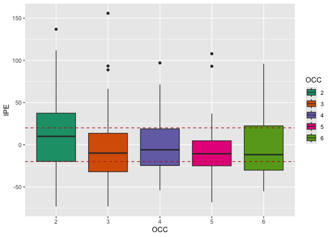

<!-- README.md is generated from README.Rmd. Please edit that file -->

# preDose 

# preDose: An R-package for Robust External Evaluation of popPKPD Models.

preDose is a free and open source package that automatize the process of
*external evaluation process* using an independent dataset from which
the original popPKPD model was developed.

Currently, the user can choose to use the package based on
either[lixoftconnectors](https://monolix.lixoft.com/monolix-api/examples/)
or via [mapbayr](https://github.com/FelicienLL/mapbayr) depending on
whether lixoftconnectors(which comes with the installation of Lixoft
software) is available in their environment.

You can perform an external evaluation for a single model from :

- a population PKPD model (coded in
  [mrgsolve](https://github.com/metrumresearchgroup/mrgsolve), or from
  [Monolix](https://monolix.lixoft.com/demo-projects/modelimplementation/),
- a data set with concentrations (NONMEM format or Monolix format)

The package requires the user to provide a popPKPD model and an external
dataset, regardless of the processing engine they choose. Below are the
functions established for both utilities.

## Installation

You can install the development version of preDose from
[GitHub](https://github.com/) with:

``` r
install.packages("devtools")
devtools::install_github("Martin-Umpierrez/preDose")
```

## Example

This is a basic example which shows you how to solve a common problem
for external evaluation.

``` r
library(preDose)
## basic example code
```

#### 1) Properly code you model

##### 1.1) Code your model in mrgsolve format.

This is an example of a Tacrolimus model developed by Han et al(2011)
:Prediction of the tacrolimus population pharmacokinetic parameters
according to CYP3A5 genotype and clinical factors using NONMEM in adult
kidney transplant recipients

``` r
Han_etal_test<-
  '$PROB
# One Comparment Model with first order absorption- Ka is FIXED
$GLOBAL
#define CP (CENT/iV)
$CMT  @annotated
EV   : Extravascular compartment
CENT : Central compartment#two compt model with first order absorption

$PARAM @annotated 
CL  :  24.13 : Clearance for CYP3A5*3*3
V  :  716 : central volume
KA  : 4.5 : absorption rate constant
ETA1 : 0 : IIVCl (L/h)
ETA2 : 0 : IIVV (L)

$PARAM @annotated @covariate
POD    : 0   : COV POST OPERATIVE DAY
HCT      : 0  : COV HCH
WT      : 0  : COV WT
CYP3A5      : 0  : Polimorfismo CYP3A5
OCC     : -99  : Occasion, shall be passed by dataset imported

$ODE
dxdt_EV = -iKA*EV;
dxdt_CENT = iKA*EV  - iCL*CP;

$MAIN
##CYP3A5 effect on Cl##

double HM = 1.186 ;  ####METABOLIZADOR ULTRA RAPIDO ####
double IM = 1.13 ;  ####METABOLIZADOR INTERMEDIO ####
double PM = 1 ;  ####METABOLIZADOR POBRE ####

if(CYP3A5==1) double CL_EFFECT = HM ;
if(CYP3A5==2) CL_EFFECT = IM ;
if(CYP3A5==3) CL_EFFECT = PM ;

double CL_HCT1 = 1.3458 ; ##Effect of HCT< 33
double CL_HCT2 = 1.124 ;  ##Effect of HCT >33

if(HCT< 33) double CL_HCT = CL_HCT1 ;
if(HCT >= 33) CL_HCT = CL_HCT2 ;

double CL_POD = - 0.00762 ;

double iCL =  CL *exp(ETA(1) + ETA1)* pow(POD, CL_POD) * CL_EFFECT * CL_HCT ;  
double iV =  V *exp(ETA(2) + ETA2) * exp (0.355*WT/59.025) ;  
double iKA =  KA ;    


$OMEGA @name IIV 
0.248 
0.237

$SIGMA  @name SIGMA @annotated
ADD : 0 : ADD residual error
PROP : 0.16 : Proportional residual error


$TABLE
double IPRED = CENT/iV;
double DV = IPRED * (1 + PROP) ;

$CAPTURE @annotated
CP : Plasma concentration (mass/volume)
iCL :  Clearance
iV : :Central Volume
iKA : KA: absorption rate constant
EVID : EVENT ID
DV : PREDICCION
OCC: OCCASION

               '
```

#### 2) Import your external data

Import the data set either in Monolix-formatted datasets or
NM-TRAN-formatted datasets Ensure that the dataset structure aligns with
the required format for proper processing.

``` r
data("external_data_mapbayr", package = "preDose")  # Cargar dataset desde el paquete
head(external_data_mapbayr)  # Ver primeras filas
#> # A tibble: 6 × 30
#>      ID   OCC    DD   AMT  TIME   POD    DV  EVID   CMT   MDV    II    SS Creatinine   SCR  eGFR ClCrea   AGE   SEX
#>   <dbl> <dbl> <dbl> <dbl> <dbl> <dbl> <dbl> <dbl> <dbl> <dbl> <dbl> <dbl>      <dbl> <dbl> <dbl>  <dbl> <dbl> <dbl>
#> 1     1     1   6    3000   168     7   0       1     1     1    12     1       5.3   469.  9.16   9.80    49     0
#> 2     1     1   6       0   168     7   9.4     0     2     0     0     0       5.3   469.  9.16   9.80    49     0
#> 3     1     2   6.5  3250   264    11   0       1     1     1    12     1       4.17  369. 12.1   12.5     49     0
#> 4     1     2   6.5     0   264    11   8.4     0     2     0     0     0       4.17  369. 12.1   12.5     49     0
#> 5     1     3   7.5  3750   360    15   0       1     1     1    12     1       3.56  315. 14.5   15.1     49     0
#> 6     1     3   7.5     0   360    15   8.4     0     2     0     0     0       3.56  315. 14.5   15.1     49     0
#> # ℹ 12 more variables: WT <dbl>, HCT <dbl>, CYP3A5 <dbl>, EXPRESSION <dbl>, PDN_DOSE <dbl>, PDNXWT <dbl>,
#> #   Heigth <dbl>, Height..m. <dbl>, BSA <dbl>, BMIcalc <dbl>, LBW <dbl>, DMELITU <dbl>
```

#### 3) Calculate individual parameters with run_MAP_estimations

The `run_MAP_estimations()` returns a list with four elements: \*
Observed data per occasion: Includes the observed values for each
individual in each occasion. \* Treatments per occasion: Contains
information on the treatments administered in each occasion. \*
Estimated individual parameters: Provides the MAP-estimated values of
individual parameters for each subject and occasion. \* Mandatory: +
Progressive + Most_Recent_Progressive + Cronologic_Ref + Most_Recent_rEF

``` r
map.est <- run_MAP_estimations(model_name = "Test_Model",
                               model_code = Han_etal_test,
                               tool = "mapbayr",
                               data = external_data_mapbayr,
                               evaluation_type= "Progressive")  # Cargar dataset desde el paquete
head(map.est[["map_estimations"]], 10)
#> $map.estimation.occ_0_1
#> Model: Test_Model 
#> ID : 49 individual(s).
#> OBS: 52 observation(s).
#> ETA: 2 parameter(s) to estimate.
#> 
#> Estimates: 
#>   ID         ETA1          ETA2
#> 1  1 -0.320890726  0.0379857047
#> 2  2  0.046760864 -0.0073378345
#> 3  3  0.002284814 -0.0002314673
#> 4  4  0.049273957 -0.0053421340
#> 5  5  0.131312414 -0.0233519095
#> 6  6  0.502843351 -0.1430738187
#> 
#> Output (101 lines): 
#>   ID DD  amt time evid cmt mdv ii ss Creatinine    SCR  eGFR ClCrea AGE SEX EXPRESSION PDN_DOSE PDNXWT Heigth
#> 1  1  6 3000  168    1   1   1 12  1       5.30  468.6  9.16   9.80  49   0          0       55  1.138    150
#> 2  1  6    0  168    0   2   0  0  0       5.30  468.6  9.16   9.80  49   0          0       55  1.138    150
#> 3  2  6 3000  408    1   1   1 12  1       0.99   87.5 89.59  90.26  39   1          0       25  0.392    175
#> 4  2  6    0  408    0   2   0  0  0       0.99   87.5 89.59  90.26  39   1          0       25  0.392    175
#> 5  3 18 9000   72    1   1   1 12  1      14.99 1325.4  3.58   7.21  59   1          0       60  0.624    176
#> 6  3 18    0   72    0   2   0  0  0      14.99 1325.4  3.58   7.21  59   1          0       60  0.624    176
#>   Height..m.  BSA BMIcalc  LBW DMELITU   DV IPRED  PRED    CP  iCL   iV iKA EVID OCC POD  HCT   WT CYP3A5     ETA1
#> 1       1.50 1.41    21.5 34.8       0  0.0  9.38  6.40  9.38 23.2  995 4.5    1   1   7 29.9 48.4      3 -0.32089
#> 2       1.50 1.41    21.5 34.8       0  9.4  9.38  6.40  9.38 23.2  995 4.5    0   1   7 29.9 48.4      3 -0.32089
#> 3       1.75 1.78    20.8 53.5       1  0.0  6.20  6.57  6.20 33.3 1043 4.5    1   1  17 29.0 63.7      3  0.04676
#> 4       1.75 1.78    20.8 53.5       1  6.2  6.20  6.57  6.20 33.3 1043 4.5    0   1  17 29.0 63.7      3  0.04676
#> 5       1.76 2.12    31.0 66.9       0  0.0 20.00 20.05 20.00 32.3 1276 4.5    1   1   3 25.0 96.1      3  0.00228
#> 6       1.76 2.12    31.0 66.9       0 20.0 20.00 20.05 20.00 32.3 1276 4.5    0   1   3 25.0 96.1      3  0.00228
#>        ETA2 OCC
#> 1  0.037986   1
#> 2  0.037986   1
#> 3 -0.007338   1
#> 4 -0.007338   1
#> 5 -0.000231   1
#> 6 -0.000231   1
#> 
#> $map.estimation.occ_0_1_2
#> Model: Test_Model 
#> ID : 49 individual(s).
#> OBS: 107 observation(s).
#> ETA: 2 parameter(s) to estimate.
#> 
#> Estimates: 
#>   ID        ETA1         ETA2
#> 1  1 -0.23374713  0.035521855
#> 2  2  0.14616515  0.126768247
#> 3  3  0.11643641  0.043605246
#> 4  4 -0.03729051  0.001914509
#> 5  5 -0.09949947  0.002831244
#> 6  6  0.50680894 -0.536198588
#> 
#> Output (205 lines): 
#>   ID  DD  amt time evid cmt mdv ii ss Creatinine   SCR  eGFR ClCrea AGE SEX EXPRESSION PDN_DOSE PDNXWT Heigth
#> 1  1 6.0 3000  168    1   1   1 12  1       5.30 468.6  9.16    9.8  49   0          0       55  1.138    150
#> 2  1 6.0    0  168    0   2   0  0  0       5.30 468.6  9.16    9.8  49   0          0       55  1.138    150
#> 3  1 6.5 3250  264    1   1   1 12  1       4.17 368.7 12.07   12.5  49   0          0       30  0.620    150
#> 4  1 6.5    0  264    0   2   0  0  0       4.17 368.7 12.07   12.5  49   0          0       30  0.620    150
#> 5  2 6.0 3000  408    1   1   1 12  1       0.99  87.5 89.59   90.3  39   1          0       25  0.392    175
#> 6  2 6.0    0  408    0   2   0  0  0       0.99  87.5 89.59   90.3  39   1          0       25  0.392    175
#>   Height..m.  BSA BMIcalc  LBW DMELITU  DV IPRED PRED   CP  iCL   iV iKA EVID OCC POD  HCT   WT CYP3A5   ETA1   ETA2
#> 1       1.50 1.41    21.5 34.8       0 0.0  8.48 6.40 8.48 25.3  992 4.5    1   1   7 29.9 48.4      3 -0.234 0.0355
#> 2       1.50 1.41    21.5 34.8       0 9.4  8.48 6.40 8.48 25.3  992 4.5    0   1   7 29.9 48.4      3 -0.234 0.0355
#> 3       1.50 1.41    21.5 34.8       0 0.0  9.23 6.96 9.23 25.2  992 4.5    1   2  11 28.7 48.4      3 -0.234 0.0355
#> 4       1.50 1.41    21.5 34.8       0 8.4  9.23 6.96 9.23 25.2  992 4.5    0   2  11 28.7 48.4      3 -0.234 0.0355
#> 5       1.75 1.78    20.8 53.5       1 0.0  5.65 6.57 5.65 36.8 1192 4.5    1   1  17 29.0 63.7      3  0.146 0.1268
#> 6       1.75 1.78    20.8 53.5       1 6.2  5.65 6.57 5.65 36.8 1192 4.5    0   1  17 29.0 63.7      3  0.146 0.1268
#>   OCC
#> 1   1
#> 2   1
#> 3   2
#> 4   2
#> 5   1
#> 6   1
#> 
#> $map.estimation.occ_0_1_2_3
#> Model: Test_Model 
#> ID : 49 individual(s).
#> OBS: 178 observation(s).
#> ETA: 2 parameter(s) to estimate.
#> 
#> Estimates: 
#>   ID        ETA1         ETA2
#> 1  1 -0.14778899  0.067740613
#> 2  2 -0.24011686 -0.783600462
#> 3  3  0.21086919  0.242430612
#> 4  4 -0.18108584  0.080840185
#> 5  5 -0.01541337  0.006064084
#> 6  6  0.44284669 -0.412880374
#> 
#> Output (343 lines): 
#>   ID  DD  amt time evid cmt mdv ii ss Creatinine SCR  eGFR ClCrea AGE SEX EXPRESSION PDN_DOSE PDNXWT Heigth
#> 1  1 6.0 3000  168    1   1   1 12  1       5.30 469  9.16    9.8  49   0          0       55  1.138    150
#> 2  1 6.0    0  168    0   2   0  0  0       5.30 469  9.16    9.8  49   0          0       55  1.138    150
#> 3  1 6.5 3250  264    1   1   1 12  1       4.17 369 12.07   12.5  49   0          0       30  0.620    150
#> 4  1 6.5    0  264    0   2   0  0  0       4.17 369 12.07   12.5  49   0          0       30  0.620    150
#> 5  1 7.5 3750  360    1   1   1 12  1       3.56 315 14.49   15.1  49   0          0       20  0.398    150
#> 6  1 7.5    0  360    0   2   0  0  0       3.56 315 14.49   15.1  49   0          0       20  0.398    150
#>   Height..m.  BSA BMIcalc  LBW DMELITU  DV IPRED PRED   CP  iCL   iV iKA EVID OCC POD  HCT   WT CYP3A5   ETA1   ETA2
#> 1        1.5 1.41    21.5 34.8       0 0.0  7.72 6.40 7.72 27.6 1025 4.5    1   1   7 29.9 48.4      3 -0.148 0.0677
#> 2        1.5 1.41    21.5 34.8       0 9.4  7.72 6.40 7.72 27.6 1025 4.5    0   1   7 29.9 48.4      3 -0.148 0.0677
#> 3        1.5 1.41    21.5 34.8       0 0.0  8.40 6.96 8.40 27.5 1025 4.5    1   2  11 28.7 48.4      3 -0.148 0.0677
#> 4        1.5 1.41    21.5 34.8       0 8.4  8.40 6.96 8.40 27.5 1025 4.5    0   2  11 28.7 48.4      3 -0.148 0.0677
#> 5        1.5 1.43    22.3 35.3       0 0.0  9.73 8.07 9.73 27.4 1036 4.5    1   3  15 26.9 50.2      3 -0.148 0.0677
#> 6        1.5 1.43    22.3 35.3       0 8.4  9.73 8.07 9.73 27.4 1036 4.5    0   3  15 26.9 50.2      3 -0.148 0.0677
#>   OCC
#> 1   1
#> 2   1
#> 3   2
#> 4   2
#> 5   3
#> 6   3
#> 
#> $map.estimation.occ_0_1_2_3_4
#> Model: Test_Model 
#> ID : 49 individual(s).
#> OBS: 229 observation(s).
#> ETA: 2 parameter(s) to estimate.
#> 
#> Estimates: 
#>   ID        ETA1         ETA2
#> 1  1 -0.12219227  0.059301520
#> 2  2 -0.36744127 -1.153906522
#> 3  3  0.30421201  0.371398310
#> 4  4 -0.25929073  0.296624570
#> 5  5  0.04742231  0.008149163
#> 6  6  0.41364034 -0.340017817
#> 
#> Output (465 lines): 
#>   ID  DD  amt time evid cmt mdv ii ss Creatinine SCR  eGFR ClCrea AGE SEX EXPRESSION PDN_DOSE PDNXWT Heigth
#> 1  1 6.0 3000  168    1   1   1 12  1       5.30 469  9.16    9.8  49   0          0       55  1.138    150
#> 2  1 6.0    0  168    0   2   0  0  0       5.30 469  9.16    9.8  49   0          0       55  1.138    150
#> 3  1 6.5 3250  264    1   1   1 12  1       4.17 369 12.07   12.5  49   0          0       30  0.620    150
#> 4  1 6.5    0  264    0   2   0  0  0       4.17 369 12.07   12.5  49   0          0       30  0.620    150
#> 5  1 7.5 3750  360    1   1   1 12  1       3.56 315 14.49   15.1  49   0          0       20  0.398    150
#> 6  1 7.5    0  360    0   2   0  0  0       3.56 315 14.49   15.1  49   0          0       20  0.398    150
#>   Height..m.  BSA BMIcalc  LBW DMELITU  DV IPRED PRED   CP  iCL   iV iKA EVID OCC POD  HCT   WT CYP3A5   ETA1   ETA2
#> 1        1.5 1.41    21.5 34.8       0 0.0  7.48 6.40 7.48 28.3 1016 4.5    1   1   7 29.9 48.4      3 -0.122 0.0593
#> 2        1.5 1.41    21.5 34.8       0 9.4  7.48 6.40 7.48 28.3 1016 4.5    0   1   7 29.9 48.4      3 -0.122 0.0593
#> 3        1.5 1.41    21.5 34.8       0 0.0  8.14 6.96 8.14 28.2 1016 4.5    1   2  11 28.7 48.4      3 -0.122 0.0593
#> 4        1.5 1.41    21.5 34.8       0 8.4  8.14 6.96 8.14 28.2 1016 4.5    0   2  11 28.7 48.4      3 -0.122 0.0593
#> 5        1.5 1.43    22.3 35.3       0 0.0  9.43 8.07 9.43 28.2 1028 4.5    1   3  15 26.9 50.2      3 -0.122 0.0593
#> 6        1.5 1.43    22.3 35.3       0 8.4  9.43 8.07 9.43 28.2 1028 4.5    0   3  15 26.9 50.2      3 -0.122 0.0593
#>   OCC
#> 1   1
#> 2   1
#> 3   2
#> 4   2
#> 5   3
#> 6   3
#> 
#> $map.estimation.occ_0_1_2_3_4_5
#> Model: Test_Model 
#> ID : 49 individual(s).
#> OBS: 282 observation(s).
#> ETA: 2 parameter(s) to estimate.
#> 
#> Estimates: 
#>   ID         ETA1         ETA2
#> 1  1 -0.138751408  0.078938994
#> 2  2 -0.436171445 -1.350114471
#> 3  3  0.380180978  0.666563142
#> 4  4 -0.267043059  0.322228491
#> 5  5 -0.009526934  0.001370777
#> 6  6  0.376713295 -0.245237759
#> 
#> Output (596 lines): 
#>   ID  DD  amt time evid cmt mdv ii ss Creatinine SCR  eGFR ClCrea AGE SEX EXPRESSION PDN_DOSE PDNXWT Heigth
#> 1  1 6.0 3000  168    1   1   1 12  1       5.30 469  9.16    9.8  49   0          0       55  1.138    150
#> 2  1 6.0    0  168    0   2   0  0  0       5.30 469  9.16    9.8  49   0          0       55  1.138    150
#> 3  1 6.5 3250  264    1   1   1 12  1       4.17 369 12.07   12.5  49   0          0       30  0.620    150
#> 4  1 6.5    0  264    0   2   0  0  0       4.17 369 12.07   12.5  49   0          0       30  0.620    150
#> 5  1 7.5 3750  360    1   1   1 12  1       3.56 315 14.49   15.1  49   0          0       20  0.398    150
#> 6  1 7.5    0  360    0   2   0  0  0       3.56 315 14.49   15.1  49   0          0       20  0.398    150
#>   Height..m.  BSA BMIcalc  LBW DMELITU  DV IPRED PRED   CP  iCL   iV iKA EVID OCC POD  HCT   WT CYP3A5   ETA1   ETA2
#> 1        1.5 1.41    21.5 34.8       0 0.0  7.65 6.40 7.65 27.9 1036 4.5    1   1   7 29.9 48.4      3 -0.139 0.0789
#> 2        1.5 1.41    21.5 34.8       0 9.4  7.65 6.40 7.65 27.9 1036 4.5    0   1   7 29.9 48.4      3 -0.139 0.0789
#> 3        1.5 1.41    21.5 34.8       0 0.0  8.32 6.96 8.32 27.8 1036 4.5    1   2  11 28.7 48.4      3 -0.139 0.0789
#> 4        1.5 1.41    21.5 34.8       0 8.4  8.32 6.96 8.32 27.8 1036 4.5    0   2  11 28.7 48.4      3 -0.139 0.0789
#> 5        1.5 1.43    22.3 35.3       0 0.0  9.65 8.07 9.65 27.7 1048 4.5    1   3  15 26.9 50.2      3 -0.139 0.0789
#> 6        1.5 1.43    22.3 35.3       0 8.4  9.65 8.07 9.65 27.7 1048 4.5    0   3  15 26.9 50.2      3 -0.139 0.0789
#>   OCC
#> 1   1
#> 2   1
#> 3   2
#> 4   2
#> 5   3
#> 6   3
```

#### 4) Actualize Indiviudal models with parameters calcualted before.

``` r
updt.md = actualize_model(map.est, evaluation_type = "Progressive") #### Individual Models
```

#### 5) Simulate observed concentrations

``` r
sim = run_ind_simulations(updt.md, map.est) # Simulate for every ID in every OCC
```

#### 6) Calucalte Metrics Accross Occasions

``` r
metrics = metrics_occ(simulations= sim, 
                      tool="mapbayr") # Simulate for every ID in every OCC

head(metrics[1],10)
#> $metrics
#>     ID OCC  TIME Ind_Prediction   DV        IPE        APE         RMSE
#> 1    1   2   264      10.202397  8.4  21.457102  21.457102 0.0460407240
#> 2    2   2   744       5.157715  4.0  28.942871  28.942871 0.0837689783
#> 3    3   2   168      16.791274 12.0  39.927279  39.927279 0.1594187646
#> 4    4   2   264      12.474168 15.8 -21.049568  21.049568 0.0443084316
#> 5    5   2   240       8.269958 12.6 -34.365410  34.365410 0.1180981409
#> 6    6   2   240       7.236177  5.8  24.761675  24.761675 0.0613140549
#> 7    6   2   241      14.361739 16.1 -10.796653  10.796653 0.0116567721
#> 8    6   2   242      13.570436 15.5 -12.448800  12.448800 0.0154972628
#> 9    6   2   248       9.305847  7.3  27.477360  27.477360 0.0755005305
#> 10   7   2   192       8.563264 12.1 -29.229224  29.229224 0.0854347527
#> 11   8   2   216      11.162344  6.1  82.989254  82.989254 0.6887216222
#> 12   9   2   120       8.157215  4.7  73.557764  73.557764 0.5410744577
#> 13  10   2   288       9.338606  9.6  -2.722856   2.722856 0.0007413946
#> 14  11   2   216       5.350110  3.0  78.337009  78.337009 0.6136687036
#> 15  12   2   120       3.099998  4.0 -22.500054  22.500054 0.0506252412
#> 16  13   2   192       9.408703  8.5  10.690624  10.690624 0.0114289447
#> 17  14   2   192      10.693000 11.2  -4.526789   4.526789 0.0020491819
#> 18  15   2   168       6.611083  6.1   8.378406   8.378406 0.0070197692
#> 19  16   2   168       4.098255  2.2  86.284323  86.284323 0.7444984383
#> 20  17   2   240       9.095784 20.5 -55.630322  55.630322 0.3094732734
#> 21  18   2   288      11.659817  8.4  38.807349  38.807349 0.1506010339
#> 22  19   2   312      13.619266 16.7 -18.447506  18.447506 0.0340310480
#> 23  20   2   168       7.863820  7.2   9.219726   9.219726 0.0085003350
#> 24  21   2   264       4.049074  6.1 -33.621742  33.621742 0.1130421535
#> 25  22   2   240       9.836280  9.1   8.090992   8.090992 0.0065464152
#> 26  23   2   192      11.806861 10.8   9.322789   9.322789 0.0086914394
#> 27  24   2   264       2.948288  4.2 -29.802668  29.802668 0.0888199015
#> 28  25   2   144       9.555375 11.7 -18.330130  18.330130 0.0335993674
#> 29  26   2   144       9.632986  9.2   4.706364   4.706364 0.0022149866
#> 30  27   2 23592       4.168467  4.8 -13.156941  13.156941 0.0173105094
#> 31  27   2 23593       6.756144 25.3 -73.295874  73.295874 0.5372285125
#> 32  27   2 23594       6.493895 18.8 -65.458005  65.458005 0.4284750399
#> 33  27   2 23596       5.943179  8.3 -28.395433  28.395433 0.0806300630
#> 34  28   2   240      10.181470  7.3  39.472187  39.472187 0.1558053545
#> 35  29   2   120      15.566979 11.4  36.552449  36.552449 0.1336081557
#> 36  30   2   144      17.913216 10.3  73.914714  73.914714 0.5463384902
#> 37  31   2   120      11.546283 10.5   9.964602   9.964602 0.0099293303
#> 38  32   2   168      11.865797  5.6 111.889227 111.889227 1.2519199216
#> 39  33   2   120       5.324573  3.2  66.392898  66.392898 0.4408016879
#> 40  34   2   216       7.747274  6.4  21.051160  21.051160 0.0443151318
#> 41  35   2   144       8.181903  8.0   2.273789   2.273789 0.0005170116
#> 42  36   2 26280       6.394832  2.7 136.845627 136.845627 1.8726725746
#> 43  37   2   120       6.828113 10.9 -37.356764  37.356764 0.1395527835
#> 44  38   2   144       6.678532  9.4 -28.951783  28.951783 0.0838205749
#> 45  39   2   192       6.662144  5.4  23.373031  23.373031 0.0546298582
#> 46  40   2   192       6.111837 19.1 -68.000852  68.000852 0.4624115869
#> 47  41   2   144       6.005625  3.7  62.314180  62.314180 0.3883057043
#> 48  42   2   144      13.828245 10.0  38.282453  38.282453 0.1465546172
#> 49  43   2   240      12.712205 10.8  17.705606  17.705606 0.0313488469
#> 50  44   2   216      13.712239 11.6  18.208958  18.208958 0.0331566134
#> 51  45   2   120       9.483664 25.4 -62.662739  62.662739 0.3926618799
#> 52  46   2   144      10.818177  7.8  38.694576  38.694576 0.1497270179
#> 53  47   2   168       9.568364  8.0  19.604544  19.604544 0.0384338144
#> 54  48   2   192       5.926869  4.9  20.956510  20.956510 0.0439175319
#> 55  49   2   120      10.356577  8.9  16.366031  16.366031 0.0267846977
#> 56   1   3   360      10.695098  8.4  27.322593  27.322593 0.0746524063
#> 57   2   3 37848       4.859537  9.9 -50.913773  50.913773 0.2592212247
#> 58   3   3   240      14.917337 11.1  34.390426  34.390426 0.1182701375
#> 59   4   3   432      12.349780 21.8 -43.349634  43.349634 0.1879190776
#> 60   5   3   336       9.776186  7.0  39.659803  39.659803 0.1572899979
#> 61   6   3   336       8.159830 12.0 -32.001415  32.001415 0.1024090565
#> 62   7   3   240      13.002006 15.3 -15.019571  15.019571 0.0225587521
#> 63   8   3   312       9.785943  6.9  41.825268  41.825268 0.1749353044
#> 64   9   3   336       8.492916  4.5  88.731469  88.731469 0.7873273612
#> 65  10   3   480       9.518061 14.0 -32.013851  32.013851 0.1024886629
#> 66  11   3   288       2.825170  2.3  22.833479  22.833479 0.0521367772
#> 67  12   3   144       3.550675  5.2 -31.717785  31.717785 0.1006017878
#> 68  13   3   384      12.149334 15.4 -21.108223  21.108223 0.0445557071
#> 69  14   3   264      10.092813  9.4   7.370350   7.370350 0.0054322052
#> 70  15   3   264       7.650655  4.6  66.318584  66.318584 0.4398154535
#> 71  16   3   360       8.616419  8.4   2.576416   2.576416 0.0006637919
#> 72  16   3   361      18.020936 16.4   9.883758   9.883758 0.0097688678
#> 73  16   3   362      16.316355 15.5   5.266806   5.266806 0.0027739245
#> 74  16   3   363      14.670937 12.8  14.616694  14.616694 0.0213647753
#> 75  16   3   368       8.618748  9.0  -4.236137   4.236137 0.0017944856
#> 76  17   3   336      15.332986 19.1 -19.722584  19.722584 0.0388980333
#> 77  18   3   384       8.263052  9.0  -8.188314   8.188314 0.0067048487
#> 78  19   3   456      12.690861 21.9 -42.050864  42.050864 0.1768275136
#> 79  20   3   240       8.410193  7.5  12.135903  12.135903 0.0147280134
#> 80  21   3   360       6.669286  7.4  -9.874511   9.874511 0.0097505966
#> 81  22   3   336      10.264948  9.6   6.926541   6.926541 0.0047976974
#> 82  23   3   264      11.366666 13.0 -12.564109  12.564109 0.0157856832
#> 83  24   3   432       5.013308  6.2 -19.140201  19.140201 0.0366347292
#> 84  24   3   433       9.597667 16.6 -42.182730  42.182730 0.1779382678
#> 85  24   3   434       8.795922 11.9 -26.084687  26.084687 0.0680410885
#> 86  24   3   435       8.010538  9.3 -13.865179  13.865179 0.0192243184
#> 87  24   3   436       7.294722  8.5 -14.179737  14.179737 0.0201064944
#> 88  24   3   440       5.016437  8.4 -40.280510  40.280510 0.1622519517
#> 89  25   3   312      11.060399 12.0  -7.830009   7.830009 0.0061309038
#> 90  26   3   240       9.480924  6.0  58.015400  58.015400 0.3365786646
#> 91  27   3 25248       3.749914 10.6 -64.623454  64.623454 0.4176190819
#> 92  28   3   336       7.184458 12.3 -41.589775  41.589775 0.1729709391
#> 93  28   3   337      13.432840 19.2 -30.037292  30.037292 0.0902238923
#> 94  28   3   338      12.757076 28.3 -54.921994  54.921994 0.3016425420
#> 95  28   3   339      12.045976 43.4 -72.244294  72.244294 0.5219237989
#> 96  28   3   340      11.373749 26.6 -57.241544  57.241544 0.3276594358
#> 97  29   3   192      13.537321  8.4  61.158582  61.158582 0.3740372178
#> 98  30   3   408      16.316269 11.3  44.391761  44.391761 0.1970628450
#> 99  31   3   288      11.520210  8.6  33.955932  33.955932 0.1153005322
#> 100 32   3   264      11.509710  4.5 155.771327 155.771327 2.4264706240
#> 101 33   3   168       4.389350  8.5 -48.360590  48.360590 0.2338746618
#> 102 33   3   169       8.628646 32.0 -73.035482  73.035482 0.5334181692
#> 103 33   3   170       8.159847 23.1 -64.675986  64.675986 0.4182983182
#> 104 33   3   176       5.625041 11.4 -50.657537  50.657537 0.2566186078
#> 105 34   3   288       7.582638  8.2  -7.528804   7.528804 0.0056682893
#> 106 35   3   240       8.939184 12.8 -30.162629  30.162629 0.0909784159
#> 107 36   3 30192       6.766432  3.5  93.326628  93.326628 0.8709859498
#> 108 37   3   192       8.910583 11.2 -20.441224  20.441224 0.0417843635
#> 109 38   3   216       8.277464  7.4  11.857623  11.857623 0.0140603215
#> 110 39   3   432       9.437661 19.5 -51.601736  51.601736 0.2662739207
#> 111 40   3   288      12.713427 18.5 -31.278775  31.278775 0.0978361789
#> 112 41   3   240       5.496548  5.1   7.775454   7.775454 0.0060457692
#> 113 41   3   241      12.263493 10.8  13.550862  13.550862 0.0183625870
#> 114 41   3   242      11.472879 10.1  13.592864  13.592864 0.0184765954
#> 115 41   3   243      10.659738 10.5   1.521314   1.521314 0.0002314396
#> 116 41   3   244       9.903417 13.3 -25.538216  25.538216 0.0652200474
#> 117 41   3   248       7.377981  6.6  11.787598  11.787598 0.0138947470
#> 118 41   3   252       5.496548  5.1   7.775455   7.775455 0.0060457696
#> 119 42   3   240      12.252487  9.9  23.762500  23.762500 0.0564656391
#> 120 43   3   312      14.522188 11.6  25.191273  25.191273 0.0634600258
#> 121 44   3   288      12.848480 12.3   4.459186   4.459186 0.0019884342
#> 122 45   3   288       7.143854 12.5 -42.849166  42.849166 0.1836051058
#> 123 46   3   216      10.982188 14.1 -22.112145  22.112145 0.0488946970
#> 124 47   3   264       8.801330  6.3  39.703656  39.703656 0.1576380280
#> 125 48   3   264       5.272667  7.9 -33.257380  33.257380 0.1106053305
#>  [ reached 'max' / getOption("max.print") -- omitted 140 rows ]
head(metrics[2],10)
#> $metrics_means
#> # A tibble: 5 × 8
#>     OCC  rBIAS rBIAS_lower rBIAS_upper MAIPE rRMSE  IF20  IF30
#>   <dbl>  <dbl>       <dbl>       <dbl> <dbl> <dbl> <dbl> <dbl>
#> 1     2 11.6        -0.576       23.7   36.0  46.0  34.5  58.2
#> 2     3 -4.78      -14.6          5.08  32.6  41.7  38.0  50.7
#> 3     4 -0.422     -10.0          9.17  26.3  33.4  38    66  
#> 4     5 -8.76      -18.5          1.02  25.9  35.1  52    66  
#> 5     6 -1.96      -13.9          9.94  31.2  36.3  30.8  53.8
```

#### 7) Make Some Important.

##### 7.1) Bias BarPlot

``` r

plot1 = metrics_Plot(mm=metrics,
             type = "bias_barplot")

print(plot1)
```

 \##### 7.2)
Bias boxplot

``` r

plot1 = metrics_Plot(mm=metrics,
             type = "bias_boxplot")

print(plot1)
```


